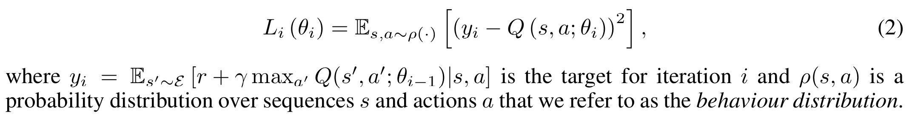
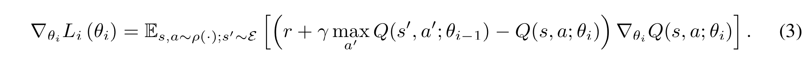
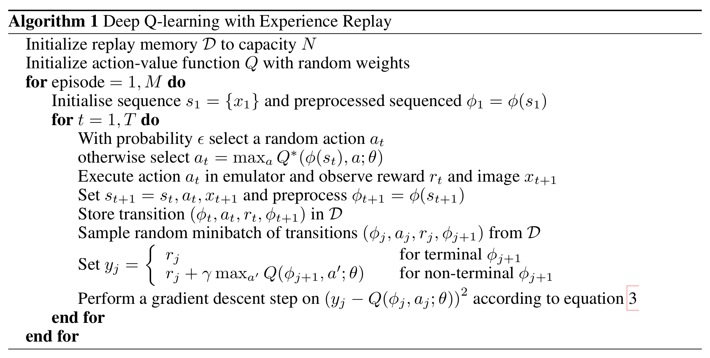

# Playing Atari with Deep Reinforcement Learning

**Authors**: [DeepMind] Volodymyr Mnih, Koray Kavukcuoglu, David Silver, Alex Graves, Ioannis Antonoglou, Daan Wierstra, Martin Riedmiller

**Year**: 2013

**Algorithm**: DQN

**Links:** [[arxiv](https://arxiv.org/abs/1312.5602v1)] [[summary]]

### Highlights

- **Neural network Q-function approximator**
- **Experience replay mechanism**

### Prerequisite

- [Q-learning](https://towardsdatascience.com/simple-reinforcement-learning-q-learning-fcddc4b6fe56)

### Problems to solve: 

- Learning to control agents from **high-dimensional sensory inputs** like vision and speech is hard.
- RL algorithms have to learn from a scalar reward that is frequently **sparse, noisy and delayed**. 
- Deep Learning algorithms assume the data samples to be independent. But RL algorithms typically encounter sequences of **highly correlated** states. Also, the data distribution is **non-stationary** for RL, it changes as the agent learns new behaviors.

### Background and Intuitions:

- **Neural network function approximator**: For atari games, the state space is large and the action space is small, it's infeasible to use Q-Learning to solve the games. We refer to neural network function approximator with weight  as a Q-network. 
  - Use **CNN**, trained with a variant of Q-Learning, with SGD to update the weights.
- **Sequence** $s_t=x_1, a_1,x_2, …, a_{t-1}, x_t$ as the state representation
- **Loss function**: minimising a sequence of loss functions $L_i(θ_i)$ that changes at each
  iteration $i$.
  - 
- **Gradient**: Differentiating the loss function with respect to the weights we arrive at the following gradient,
  - 

### Deep Q-Learning

- **Algorithm**:

> 

- **Experience replay mechanism**
  - Stores the agent’s experiences at each time-step. $e_t = (s_t, a_t, r_t, s_{t+1})$ in a data-set $D = e_1 , ..., e_N$ , pooled over many episodes into a *replay memory*
  - Then we apply minibatch Q-learning updates to samples of experience, $e \sim D$, randomly drawn from replay memory.
  - Preprocess the histories by a function $\phi$ to make sure fixed length representation of histories.
- **Advantages of the algorithm**:
  1. Each step is potentially used for updates -> **data efficiency**
  2. learning directly from consecutive samples is inefficient, due to the strong correlations between the samples; **randomizing the samples** breaks these correlations and therefore reduces the variance of the updates.
  3. By using **experience replay** the behavior distribution is averaged over many of its previous states, smoothing out learning and avoiding oscillations or divergence in the parameters.

### Results and experiments:

- **Model Architecture:** 
  - Input: 84 × 84 × 4 image produced by $\phi$.
  - Hidden layers: three convolutions followed by the final hidden layer is fully-connected and consists of 256 rectifier units. 
  - Output layer is a fully-connected linear layer with a single output for each valid action. The number of valid actions varied between 4 and 18 on the games we considered.
- **Techniques**:
  - **Reward clipping**: Since the scale of scores varies greatly from game to game, we
    fixed all positive rewards to be 1 and all negative rewards to be −1, leaving 0 rewards unchanged. Clipping the rewards in this manner limits the scale of the error derivatives and makes it easier to use the same learning rate across multiple games.
  - **Frame-skipping**: The agent sees and selects actions on every $k^{th}$ frame instead of every
    frame, and its last action is repeated on skipped frames. -> play more games without increasing too much runtime.
- **Evaluation Metrics**: 
  - **Total reward** the agent collects in an episode or game averaged over a number of games: noisy and unstable.
  - The policy’s estimated **action-value function Q**: more stable

### Reference:

1. 机器之心：[重磅 | 详解深度强化学习，搭建DQN详细指南（附论文）](https://mp.weixin.qq.com/s?__biz=MzA3MzI4MjgzMw==&mid=2650716425&idx=1&sn=bf52c653b7cd054ce721ce5be928c623&scene=4) 
