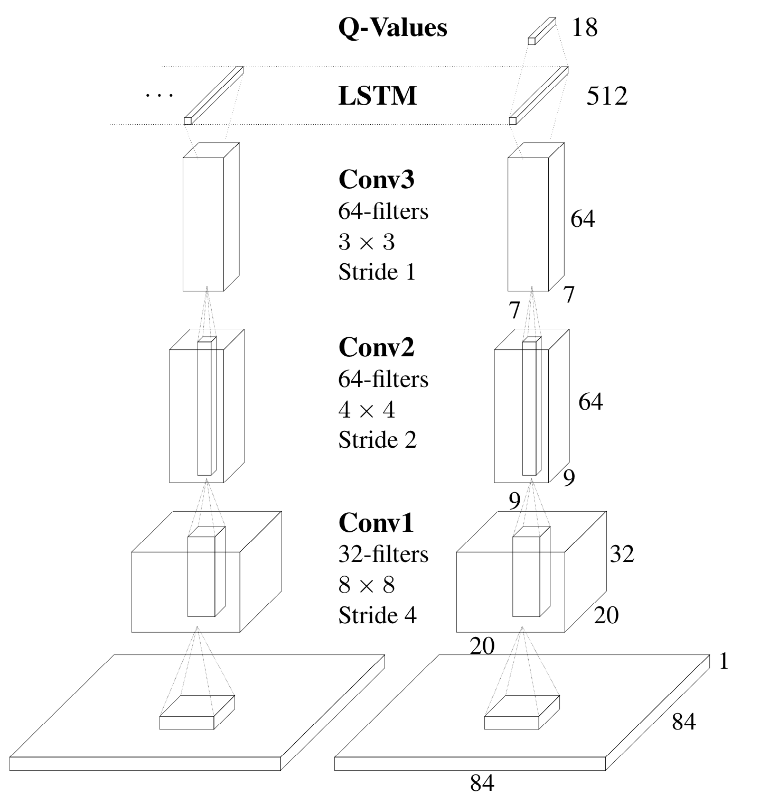
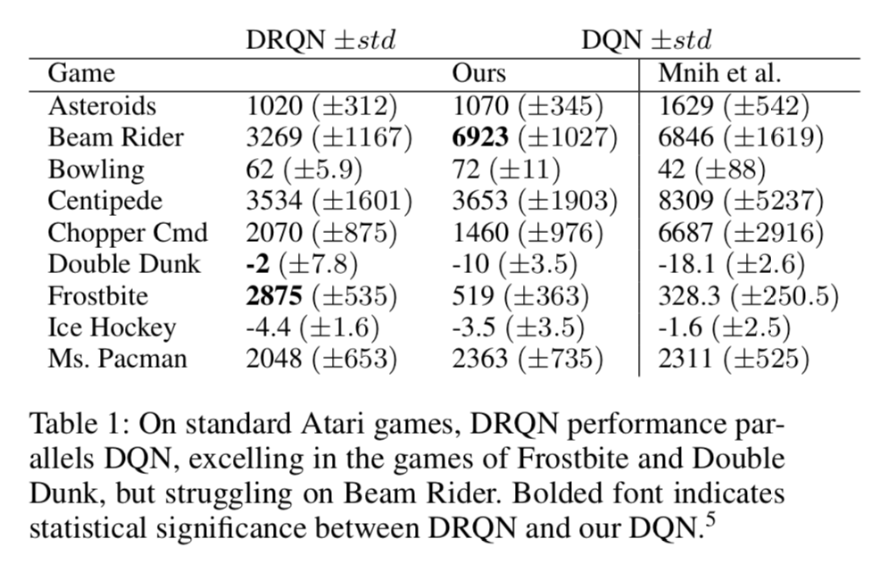
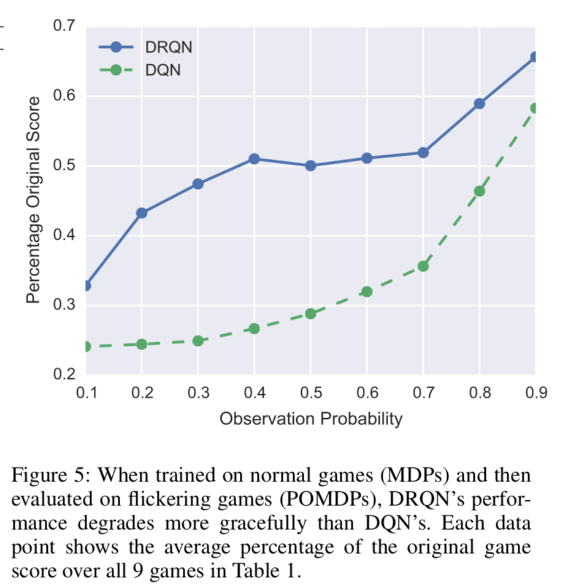

# Deep Recurrent Q-Learning for Partially Observable MDPs

**Authors**: Matthew Hausknecht and Peter Stone

**Year**: 2017

**Links:** [[arxiv](https://arxiv.org/abs/1507.06527)] [[summary]()]

**Algorithm**: **Deep Recurrent Q-Learning**

### Highlights

- **Partially-Observable Markov Decision Process (POMDP)**
- **LSTM + Deep Q-Learning**

### Problems to solve

- Vanilla Deep Q-Learning learns the mapping from a limited number of past states. In the case of learning 4 consecutive frames, any game that requires a memory of more than four frames become POMDP. 
  - Example: In Pong, the velocity of the ball can not be revealed by only showing the current screen. But knowing the velocity is crucial for this game.
- Real-world tasks often feature incomplete and noisy state information resulting from partial observability.

### Background and Intuitions

- Deep Q-Learning
- Partial Observability
  - **POMDP** can be described by $(S,A,P,R,\Omega, O)$ — (states, actions, transitions, rewards). $o\in \Omega$ and $o\sim O(s)$
  - In general case, estimating a Q-value from an obervation can be arbitrarily bad since $Q(o,a|\theta)\ne Q(s,a|\theta)$. Our goal is to narrow the gap between these two.

### Approach

#### DRQN Architecture

- Replacing DQN's first fully connected layer with a recurrent LSTM layer of the same size.
- The last two timesteps are shown here. LSTM outputs become Q-Values after passing through a fully-connected layer. 
  - 

#### Stable Recurrent Updates

- **Bootstrapped Sequential Updates**: Episodes are selected randomly from the replay memory and updates begin at the beginning of the episode and proceed forward through time to the conclusion of the episode. 
  - Carrying the LSTM’s hidden state forward from the beginning of the episode
  - But violate DQN's random sampling policy (make sure the independence of sampling)
- **Bootstrapped Random Updates**: Episodes are selected randomly from the replay memory and updates begin at random points in the episode and proceed for only *unroll iterations* timesteps (e.g. one backward call). 
  - Random sampling but the LSTM’s hidden state must be zeroed at the start of each update. -> harder to learn functions that span longer time scales than the number of timesteps reached by back propagation through time.
- Experiments indicate both are viable and yield convergence.

### Experiments and Results

- Flickering Atari Games
  - Introduce **Flickering Pong POMDP** by either revealing or obscuring the screen with a probability $p=0.5$.
- 

#### MDP to POMDP Generalization

### Reference:

1. [用Deep Recurrent Q Network解决部分观测问题！](https://www.jianshu.com/p/305aee09ec31)
