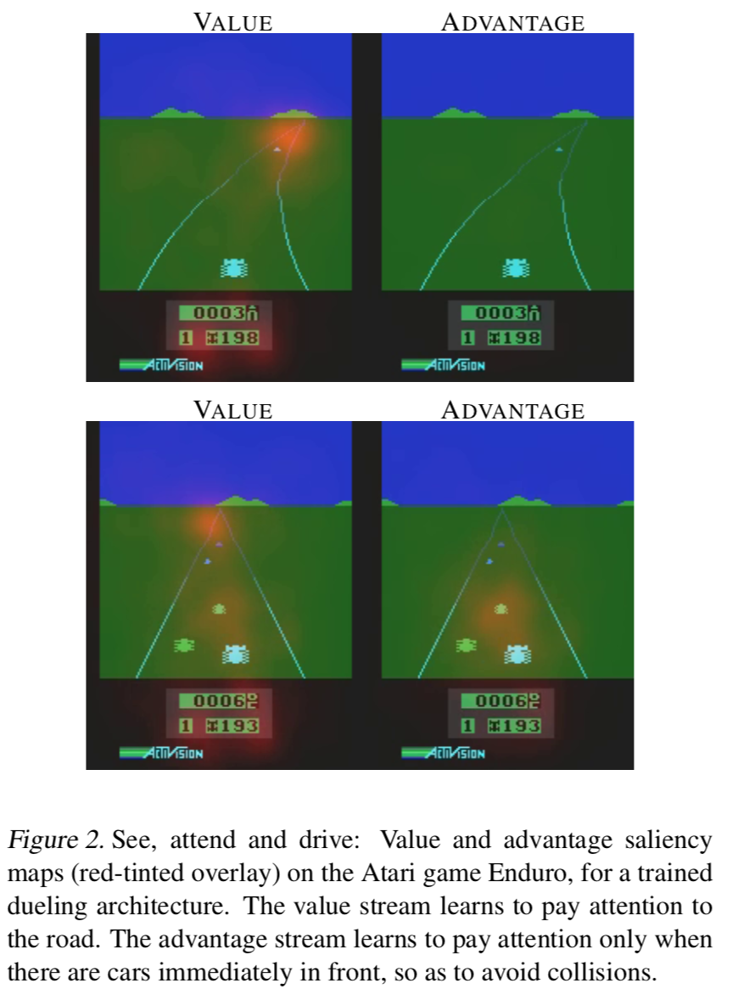
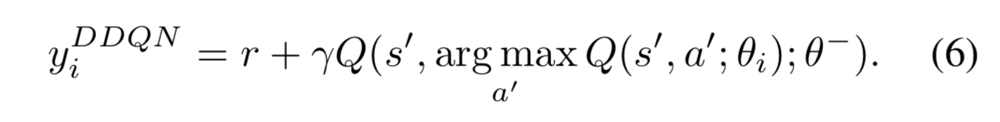
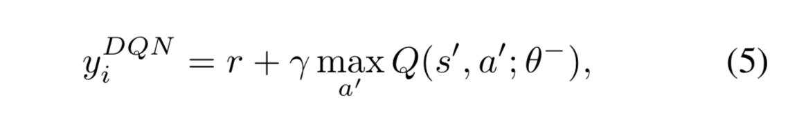
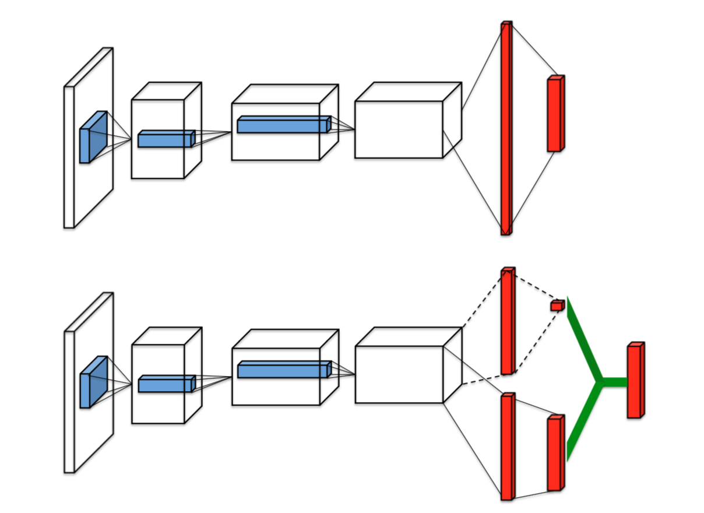
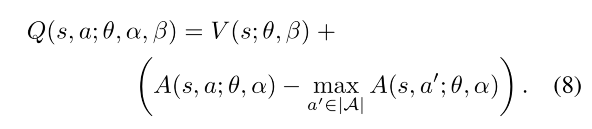
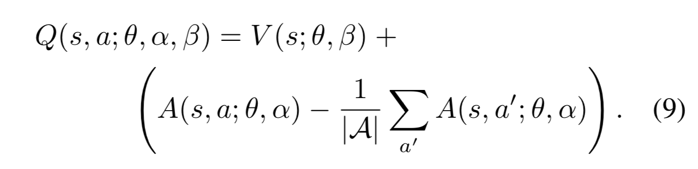

# Dueling Network Architectures for Deep Reinforcement Learning

**Authors**: Ziyu Wang, Tom Schaul, Matteo Hessel, Hado van Hasselt, Marc Lanctot, Nando de Freitas

**Year**: 2015

**Links:** [[arxiv]] [[summary]]

**Algorithm**: **Dueling DQN**

### Highlights

- **Dueling Network Architectures**
- **Solving Unidentifiability**

### Problems to solve

- It's unnecessary to estimate the value of each action choice.
- Intuitively, the dueling network can learn which states are valueable or not, without having to learn the effect of each action for each state. 
- It can be demonstrated that the additional advantage function approximator can quickly identify the correct action during policy evaluation as redundant or similar actions are added to the learning problem.
  - 

### Background and Intuitions

- **Advantage function​**: $A^\pi(s,a)= Q^\pi(s,a)-V^\pi(s)$
  - $\mathbb{E}_{a\sim\pi(s)}[A^\pi(s,a)]=0$
  - $V$ measures how good it is to be in $s$
  - Q measures the value of choosing a particular action $a$ when in $s$.
- **Deep Q-networks**
- **Double Deep Q-networks**
  - In Q-learning and DQN, the $max$ operator uses the same values to both select and evaluate an action.
  - DDQN uses the following target
  - as opposed to original
- **Prioritized Replay**
  - The key idea is to increase the replay probability of experience tuples that have a high expected learning progress.

### Approach

#### The Dueling Network Architecture

- The dueling network has two streams to separately estimate (scalar) **state-value** and the **advantages for each action**; the green output module implements equation (9) to combine them.
  - 
- Two streams:
  - One stream of fully-connected layers outputs a scalar $V(s;\theta,\beta)$
  - The other stream output an $|\mathbb{A}|$-dimensional vector $A(s,a;\theta,\alpha)$
- Aggregation: using the definition of advantage, we construct the aggregating module as follows:
  - 

#### Unidentifiability

- **Problem**: Equation (7) is unidentifiable in the sense that given $Q$ we cannot recover $V$ and $A$ uniquely. To see this, add a constant to $V (s; θ, β)$ and subtract the same constant from $A(s, a; θ, α)$. This constant cancels out resulting in the same $Q$ value.
- **Improvement**: For a deterministic policy, $a^∗ = \arg{\max}_{a′∈A} Q(s,a')$, it follows
  that $Q(s, a^∗) = V (s)$ and hence $A(s, a^∗) = 0$. So we can force the advantage function estimator to have zero advantage at the chosen action.
  - 
  - Now, for $a^∗ = \arg \max _{a'∈A}Q(s, a'; θ, α, β) = \arg \max_{a'∈A} A(s, a'; θ, α)$, we obtain $Q(s, a^∗; θ, α, β) = V (s; θ, β)$. Hence, the stream $V (s; θ, β)$ provides an estimate of the value function, while the other stream produces an estimate of the advantage function.
- **Alternative**: 
  - 
  - (9) does not change the relative rank of $A$ (and hence $Q$) values. On the one hand this loses the original semantics of $V$ and $A$ because they are now off-target by a constant, but on the other hand it increases the stability of the optimization.

### Reference:

1. [Dueling DQN](https://zhuanlan.zhihu.com/p/66069958)
