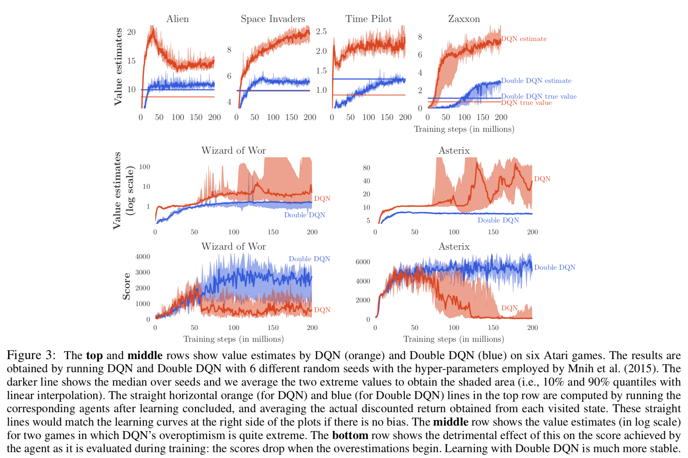
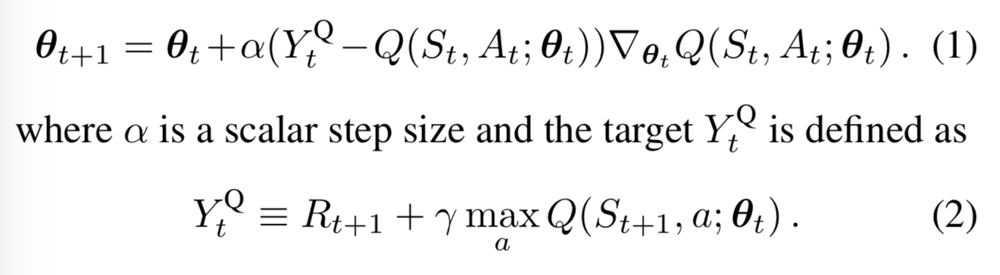
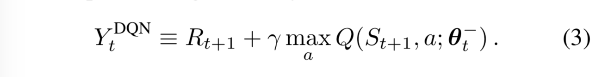
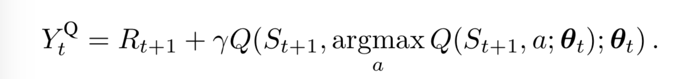
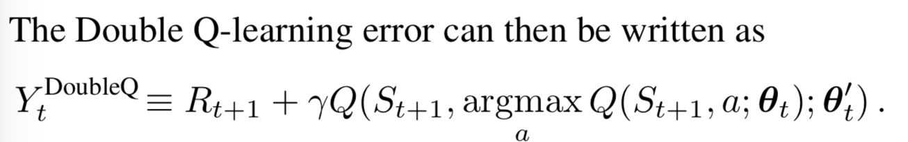
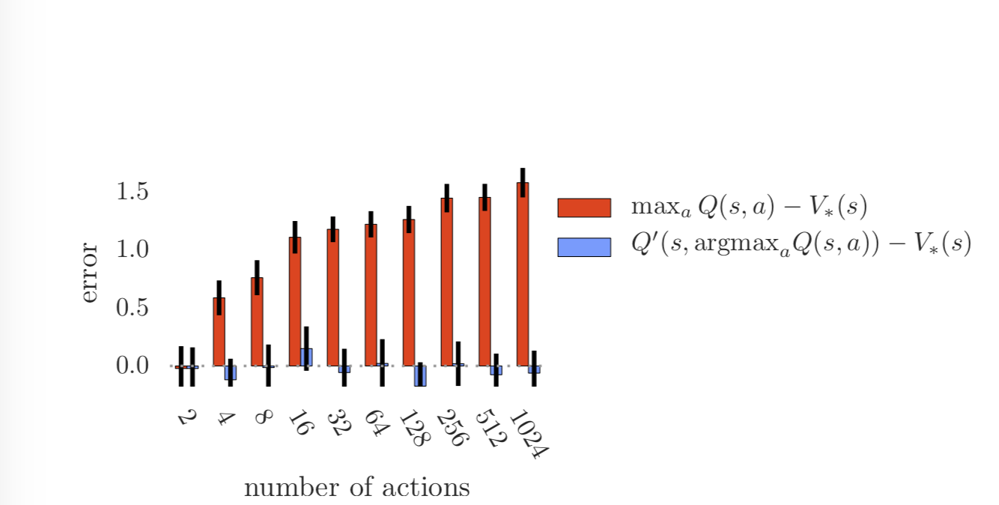
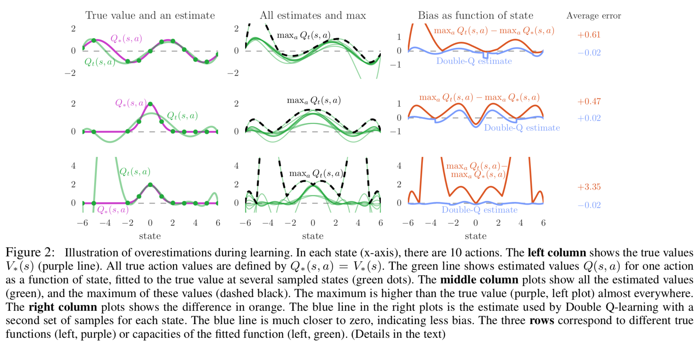
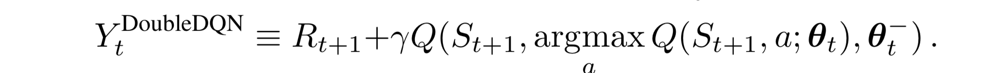

# Deep Reinforcement Learning with Double Q-learning

**Authors**: Hado van Hasselt, Arthur Guez, David Silver

**Year**: 2015

**Links:** [[arxiv](https://arxiv.org/abs/1509.06461)] [[summary](https://github.com/kmdanielduan/Key-Paper-Summary-in-DRL/blob/master/01.%20Model-Free%20RL/%5B004%5D%20Deep%20Reinforcement%20Learning%20with%20Double%20Q-learning.md)]

**Algorithm**: **Double DQN**

### Highlights

- **Action value overestimation in Deep Q-learning**
- **Double Q-learning**

### Problems to solve

- Q-learning algorithm is known to overestimate action values under certain conditions.
- Overestimation of action values causes instabilities.
- 

### Background and Intuitions

- **Q-Learning**

  - Standard Q-learning update:
  - 

- **Deep Q Networks**

  - Two important ingredients of the DQN algorithm as proposed by Mnih et al. (2015) are the use of a target network, and the use of experience replay.
  - The target used by DQN is:
  - 

- **Double Q-learning**

  - In the original Double Q-learning algorithm, two value functions are learned by assigning each experience randomly to update one of the two value functions, such that there are two sets of weights, $θ$ and $θ′$.

  - 

    

- **Overoptimism due to estimation errors**

  - **Theorem 1**: … Under Q-Learning, $\max_aQ_t(s,a)\ge V^*(s)+\sqrt{\frac{C}{m-1}}$. This lower bound is tight. Under the same conditions, the lower bound on the absolute error of Double Q-learning estimate is zero.
  - More typically, the overoptimism increases with the number of actions.
    - 

  - Error due to overestimation occurs in function approximation:
    - 

### Approach

#### Double DQN

- The idea of Double Q-learning is to reduce overestimations by decomposing the max operation in the target into action selection and action evaluation.
- 
- Double Q-learning can be used at scale to successfully reduce overoptimism, resulting in more stable and reliable learning.

### Reference:

1. [解析 DeepMind 采用双 Q 学习 (Double Q-Learning) 深度强化学习技术](https://www.jianshu.com/p/193ca0106aa5)
