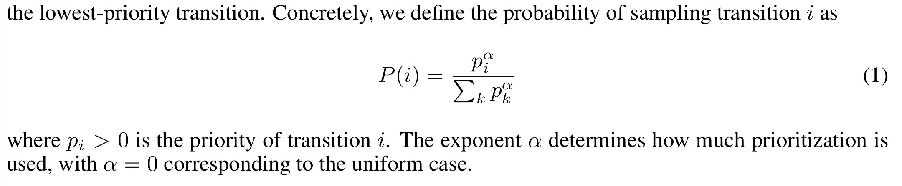
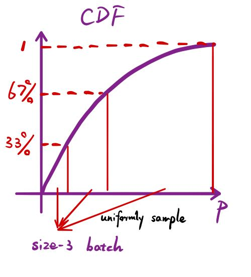
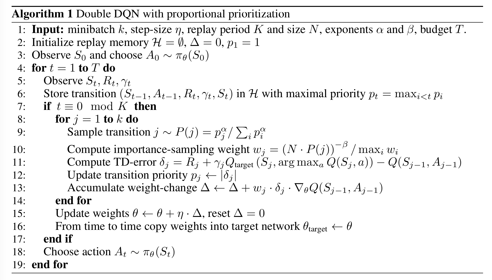

# Prioritized Experience Replay

**Authors**: Tom Schaul, John Quan, Ioannis Antonoglou and David Silver

**Year**: 2016

**Links:** [[arxiv]] [[summary]]

**Algorithm**: **Prioritized Experience Replay (PER)**

### Highlights

- **Prioritized Experience Replay**
- **Stochastic Prioritization**
- **Annealing the bias by importance sampling**

### Background

- In simplest form of Q-learning, they discard incoming data immediately ->
  1. strongly correlated updates break the i.i.d asspumtion
  2. rapid forgetting of possibly rare experiences that would be useful later on
- **Experience Replay** use a large replay memory, sampling from it **uniformly at random**, and revisited each transition eight times on average to solve problems above. But not efficient.
- Intuitively, the importance of different transitions should be different

### Approach

- **Prioritized Experience Replay** proposed a method of prioritizing replaying transitions with high expected learning progress, as measured by their **temporal-difference(TD) error** 
  - => make lead to loss of diversity, alleviated with **stochastic prioritization** and **introduce bias**, which we correct with **importance sampling**.

#### Prioritizing with TD-error

- TD-error $\delta$: how far the value is from its next-step bootstrap estimate
  - indicating how "suprising" or unexpected the transition is
- Proposed method 1: **Greedy TD-error prioritization**
  - Procedure
    - This algo only stores the last encounter TD error with this transition in the memory for efficiency. The transition with the largest absolute TD error is replayed. Apply a Q-learning update to the weights in proportion to the TD error.
    - New transitions without TD-error will be maximally prioritized to be replayed first.
    - => substantial increase in efficiency already
  - Problem
    - Not exactly prioritize the right transitions: TD-error of each transition is for the previous update but not for the current one, due to not updating all TD-errors each time.
    - Overfitting: errors shrink slowly => initially high error transitions get replayed frequently.
    - Sensitive to noice spikes (e.g. when rewards are stochastic)

#### Stochastic Prioritization

- Introduce a stochastic sampling method:
  - The probability of being sampled is monotonic in a transition's priority, while guaranteeing a non-zero probability even for the lowest-priority transition.
- **Softmax**
  - **Variant 1 (proportional prioritization)**: 
    - $p_i=|\delta_i|+\epsilon$, $|\delta_i|$ is TD-error, $\epsilon$ is to prevent probability from being zero
    - **more sensitive to outliers**
    - use sum-tree for implementation
  - **Variant 2 (rank-based prioritization)**: 
    - $p_i=\frac{1}{\text{rank}(i)}$, where $\text{rank}(i)$ is the rank of transition $i$ when the replay memory is sorted according to $|\delta_i|$
    - We approximate the cumulative density function with a piecewise linear function with k segments of equal probability. Similar to stratified sampling.

#### Annealing the bias by importance sampling

- Problem: changing the sampling method changes the distribution of samples $x$

  - $\mathbb{E}_{x\sim A}[f(x)] \ne \mathbb{E}_{x\sim B}[\cdot]$

- **Importance sampling**

  - $𝔼_{x∼A}[f(x)]=\sum_xP_A(x)f(x)=∑_xP_B(x)\frac{P_A(x)}{P_B(x)}f(x)=𝔼_{x∼B}[\frac{P_A(x)}{P_B(x)}f(x)].$ (Hence it's biased)

    - $P_A(s)=\frac{1}{N}, P_B(x)=P(i)$, then we get importance-sampling weight

  - $$
    w_i=(\frac{1}{N}\cdot \frac{1}{P(i)})^\beta
    $$

    - $\beta$ is used to adjust the extent of annealing the bias (diminishing the bias through time)
    - For stability reasons, we always normalize weights by $1/ \max_i w_i$ so
      that they only scale the update downwards. (**not sure what this means???**)

#### Algorithm

### Discussion and Others

- **Rank-based** variant more robust, because not affected by outliners nor error magnitudes.
- **Prioritized supervised learning** was explored on imbalanced MNIST dataset.
- **Feedback for exploration**
- **Prioritized memories**: help determine which transitions to store and when to erase them.