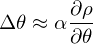
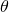
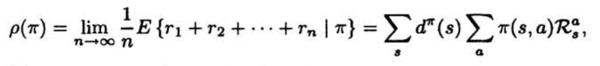
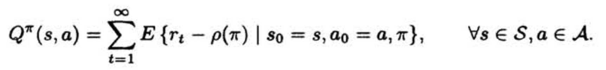
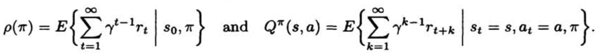
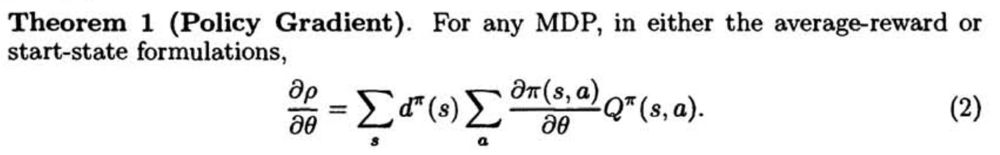
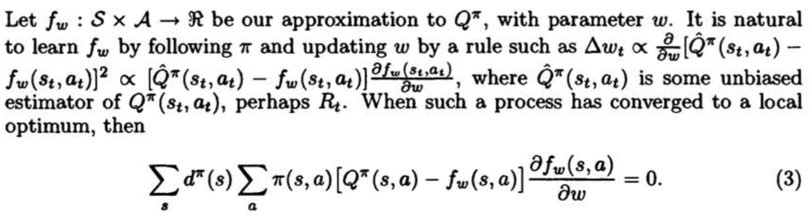
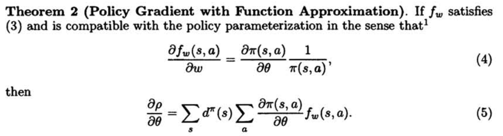
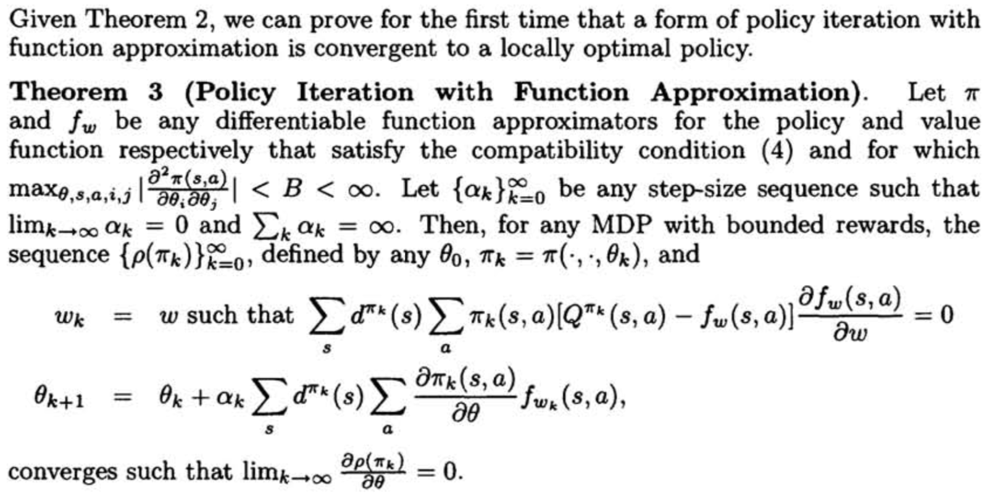

# Policy Gradient Methods for Reinforcement Learning with Function Approximation

**Authors**: Richard S. Sutton, David McAllester, Satinder Singh, Yishay Mansour

**Year**: 2000

**Links:** [[paper](https://papers.nips.cc/paper/1713-policy-gradient-methods-for-reinforcement-learning-with-function-approximation.pdf)] [[summary](https://github.com/kmdanielduan/Key-Paper-Summary-in-DRL/blob/master/13.%20Classic%20Papers%20in%20RL%20or%20Review/%5B100%5D%20Policy%20Gradient%20Methods%20for%20Reinforcement%20Learning%20with%20Function%20Approximation.md)]

**Contributions:** Established policy gradient theorem and showed convergence of policy gradient algorithm for arbitrary policy classes.

#### Problems to solve: 

- The previous value-function approach has worked well in many applications, but has several limitations. 
  - oriented toward finding deterministic policies, whereas the optimal policy is often stochastic, selecting different actions with specific probabilities
  - an arbitrarily small change in the estimated value of an action can cause it to be, or not be selected

#### Approach:

- Approximate a **stochastic policy** directly using an independent function approximate with its own parameters.
- Policy parameters can be updated as: 
  - small change to  only causes small changes in the policy.

#### Policy Gradient Theorem

- Two formulations
  - average reward formulation
    - policies are ranked according to their long-term expected reward per step
    - 
    - the value of a state-action pair given a policy is defined as:
    - 
  - start-state formulation
    - there is a designated start state s0
    - 
- **Theorem 1**

#### Policy Gradient with Approximation

- 
- 
- Given a policy parameterization, Theorem 2 can be used to derive an appropriate form for the value-function parameterization.

#### Convergence of Policy Iteration with Function Approximation

- 

